Here is an ambitious list of climbs I'd like to complete this 2020 summer. 
Pictures are not mine, just using them as a reference.

- [Stech-Salathe, 10a](#stech-salathe)
- [El Cap East Buttress, 10b](#el-cap-east-buttress)
- [Crest Jewel and Crest Jewel Direct, 10a/b](#crest-jewel-and-crest-jewel-direct)
    * 11/01/20 with Noelle from Royal Arches
- [Serenity to Sons](#serenity-to-sons)
    * 10/31/20 with Noelle
- [Freeblast, 11b/c](#freeblast)
    * 07/18/20 with Austin
- [Rostrum N Face, 11b/c](#rostrum-n-face)
- [Astroman, 11c](#astroman)
- [Half Dome in a Day, 11c](#half-dome-in-a-day)
- [Incredible Hulk, 11- to 12-](#incredible-hulk)
- [Lover's Leap 25 Pitches IAD](#leap-25-pitches-iad)
    * 07/26/20 with Fraser

# Stech Salathe

Info: [Mountain Project](https://www.mountainproject.com/route/105862873/steck-salathe)

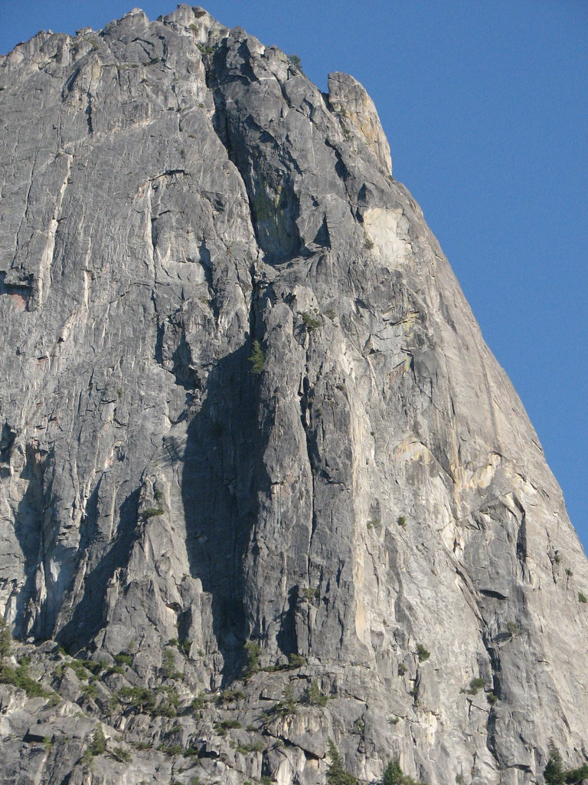

# El Cap East Buttress

Info: [Mountain Project](https://www.mountainproject.com/route/105833467/east-buttress)

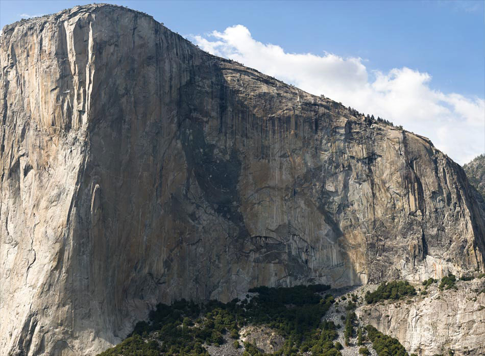

# Crest Jewel and Crest Jewel Direct

Info: [Mountain Project](https://www.mountainproject.com/route/105862890/crest-jewel-and-crest-jewel-direct)

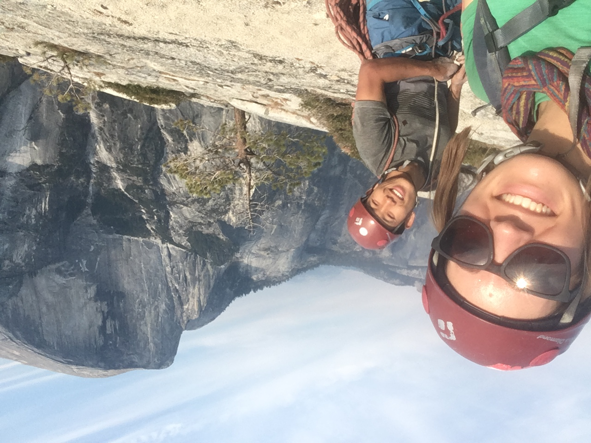

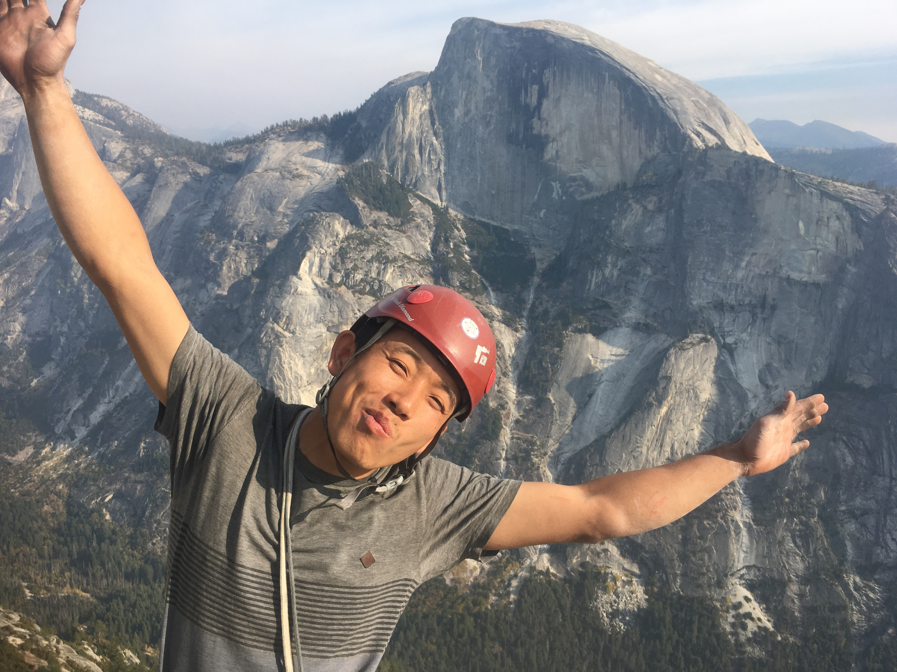

Amazing climbing on Royal Arches, finished in 2.5 hrs. We got lost finding our way to Crest Jewel direct start. It is on a talus field. Bolts are harder to find and slab climbing is not as easy as I hoped, but nothing can beat the 30+ pitches of continous climbing on the amazing granite with Noellie!

# Serenity to Sons

Info: [Mountain Project](https://www.mountainproject.com/route/105862915/sons-of-yesterday)

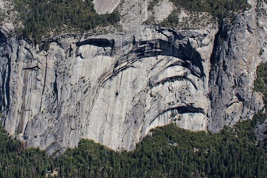

Amazing low angled climbing, kind of hard on my feet, but great for my hands!

# Freeblast

Info: [Mountain Project](https://www.mountainproject.com/route/105991737/freeblast)

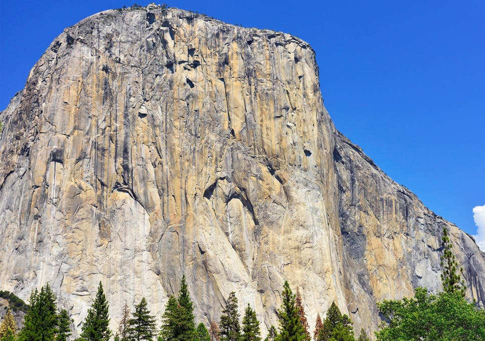

07/18/20, with Austin. Fell under the roof and on both slab pitches. Worked through those sections but the roof felt very hard. 

Beta: 

- P1-2, Linked, easy climbing, move right into the double crack, left side crack is a bit easier (10). 
- P3, Hard climbing with hard-to-place pro if the fixed gears are not there. For the roof, trust the foot, maybe left hand over the roof on the crimp, and right hand reach out to the blind pin scar. (11b/c)
- P4, I don't remember this pitch, maybe we linked with P3
- P5, exciting climbing, pretty secure except the section below a buldge, I tried to put in a cam below that but could not, so I just moved on to the bolt. Next section of slab climbing is hard. I fell at the same place they filmed Alex (11b/c)
- P6, suprisingly hard in a warm day. After a couple tries, I managed to do the  moves (11b/c) 
- P7, I might have linked it to P6, easy climbing to the base of half dollar. A few pitons for the anchor, dont trust them!! 
- P8, Mostly easy climbing with one hard move into chimney (10b)
- P9-10, Linked, easy climbing again, we did not down climb the 10d pitch

Gears: small micro offset nuts (maybe useable in P5, but we didn't use them), offset cams to 0.5". Double to #2 with one #3. I do not remember using #2s either frankly, most of the gears are small. Double rope rap.

Time: Left camp at 5am, started 5:30am, top of pitch 10 at 11am. Then took us 1 hr to rap all the way down with fixed ropes. Did not climb in the sun until the last couple pitches.

Food/Water: 1 Liter of water each person, plus 1 bar (300 cal), eat yo damn breakfast!

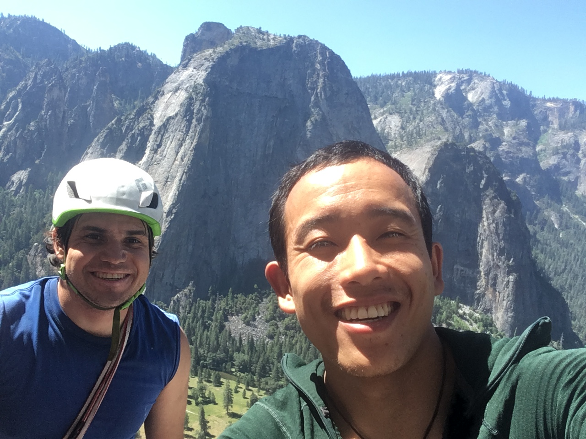

# Astroman

Info: [Mountain Project](https://www.mountainproject.com/route/105845493/astroman)

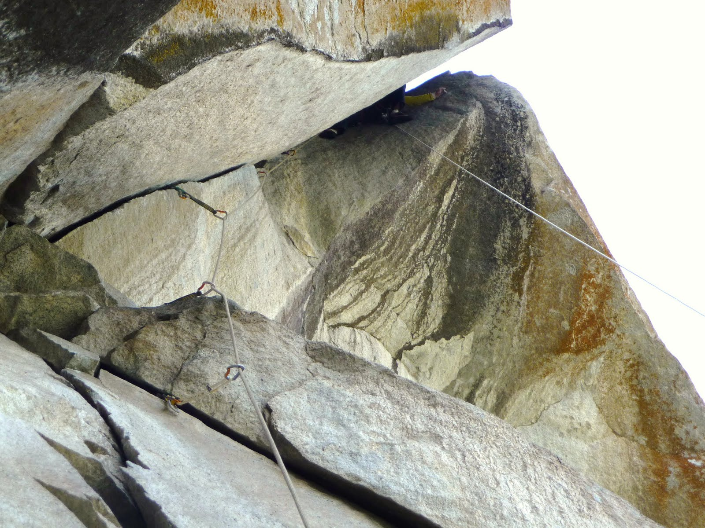

# Rostrum N Face

Info: [Mountain Project](https://www.mountainproject.com/route/105863822/the-north-face)

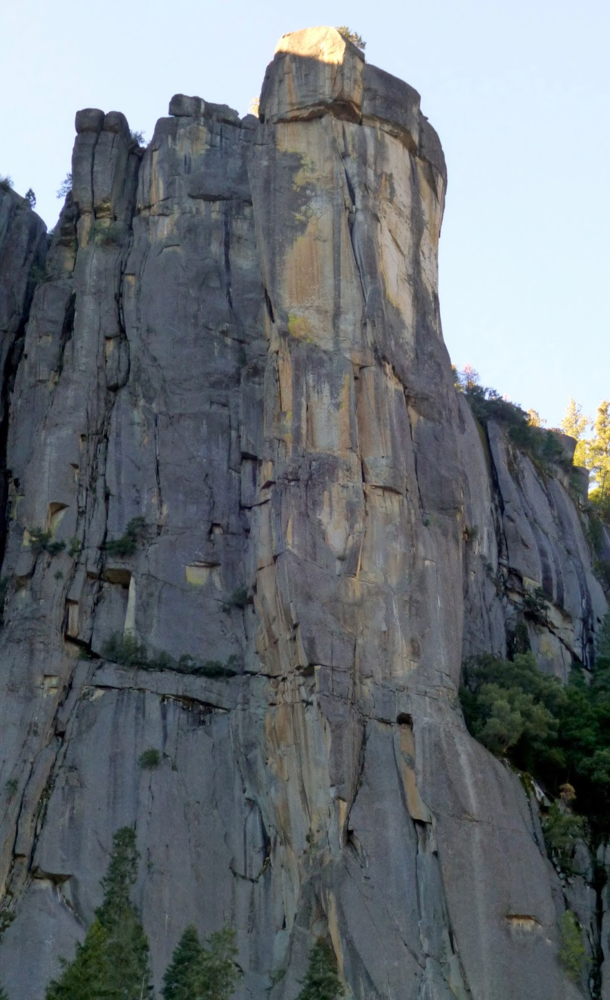

# Half Dome in a Day

Info: [Mountain Project](https://www.mountainproject.com/route/105912416/regular-northwest-face-of-half-dome)

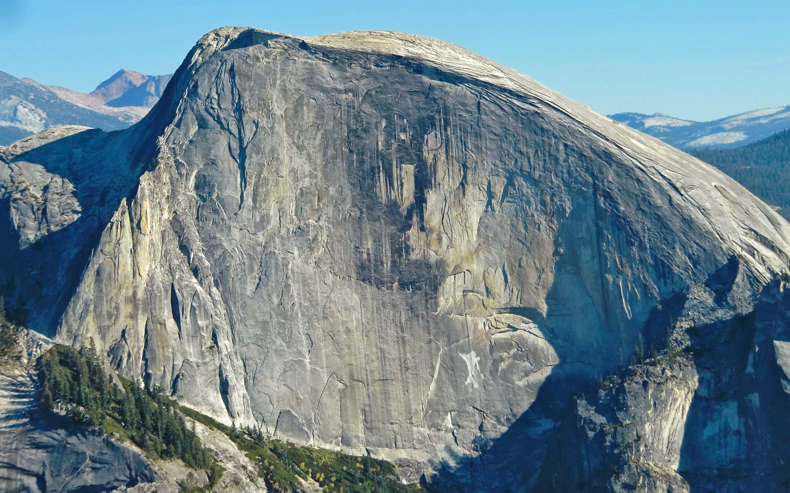

# Incredible Hulk
Info: [Positive Vibration, 11a](https://www.mountainproject.com/route/105860676/positive-vibrations), [Sunspot Dihedral, 11b](https://www.mountainproject.com/route/106499440/sunspot-dihedral), [Astrohulk, 11](https://www.mountainproject.com/route/106499476/astrohulk), [Venturi Effect, 12](https://www.mountainproject.com/route/106512114/the-venturi-effect), [Lost in the Sun, 12a](https://www.mountainproject.com/route/107244844/lost-in-the-sun)

Planned: July 24th, with Fraser. Going for Positive Vibration, may tag on something else.

Aug 15th, Peter and I set out for Positive Vibration and Sun Spot. We started pre-dawn and finished the first two pitches in the dark. The climbing was 100% straight forward, and there is no route finding unlike most other alpine climbs. Perfect hand jams definatly brought smiles to my face. We finished the climb and down within 6 or 7 hrs. 

We went to try Tradewind in the afternoon. The stem felt hard for the grade, but Peter seemed to have figured out a way to climb smoothly.
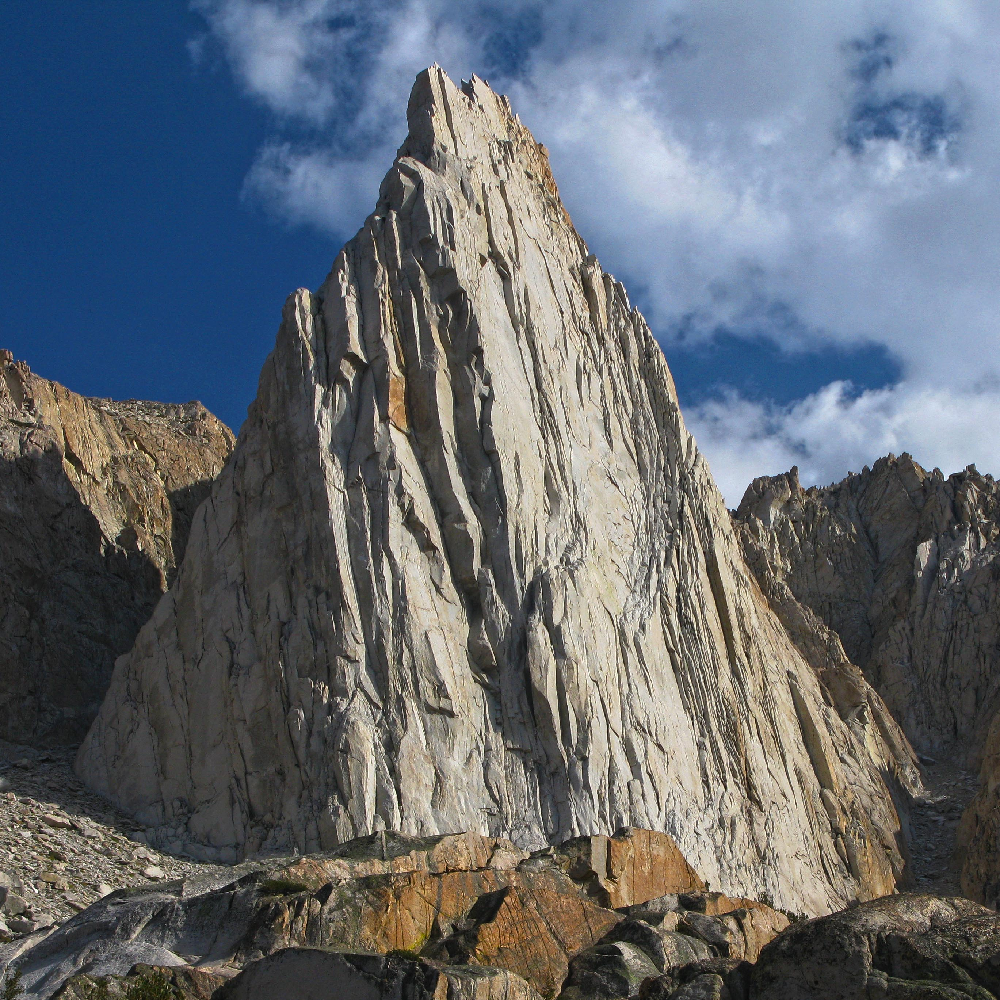

# Leap 25 Pitches IAD

My partner and I climbed a lot in the Leap, and have always wanted to see what is the biggest link-up we could do in a day while dodging parties. At the time writing this we have done 15 pitches in a day, and many of climbs listed we have never touch it before. The crux would be Freak Show, Under the Big Top and able to dodge the party on the last three popular climbs. We might need to sub them with other similiar climbs in the area.

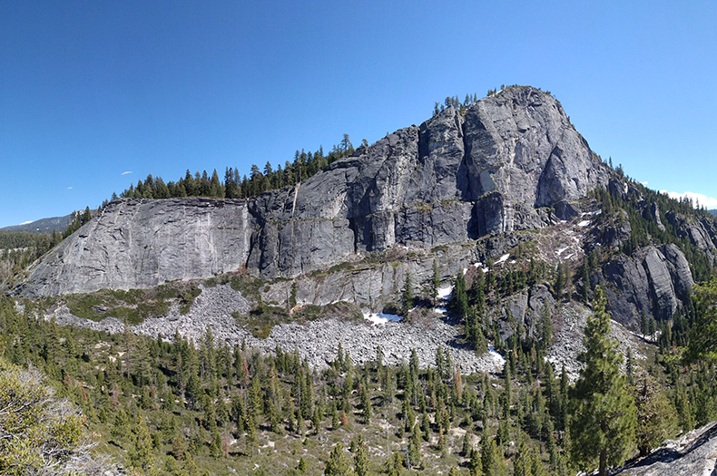

[Surrealistic Pillar](https://www.mountainproject.com/route/105798307/surrealistic-pillar-direct) (10b, 3), [Boot Hill](https://www.mountainproject.com/route/105872309/boot-hill) (11a, 1), [Tombstones Terror](https://www.mountainproject.com/route/105798338/tombstone-terror) (10c, 1), [Stem Meister](https://www.mountainproject.com/route/105872301/stem-meister) (10a, 1), [Arctic Breath](https://www.mountainproject.com/route/105889312/arctic-breeze) (10a, 1), [The Gamoke](https://www.mountainproject.com/route/105897467/the-gamoke) (10b, 2), [Hospital Corner](https://www.mountainproject.com/route/105798333/hospital-corner) (10a, 2), [Freak Show](https://www.mountainproject.com/route/109780194/freak-show) (11c/d, 1), [Under the Big Top](https://www.mountainproject.com/route/109780301/under-the-big-top) (10d, 2), [Traveler Buttress](https://www.mountainproject.com/route/105812520/traveler-buttress) (.9, 2), [The Line](https://www.mountainproject.com/route/105798280/the-line) (.9, 3), [Bear's Reach](https://www.mountainproject.com/route/105798294/bears-reach) (.8, 3), [Haystack](https://www.mountainproject.com/route/105810596/haystack) (.8, 3)

07/26/2020, Try #1 with Fraser

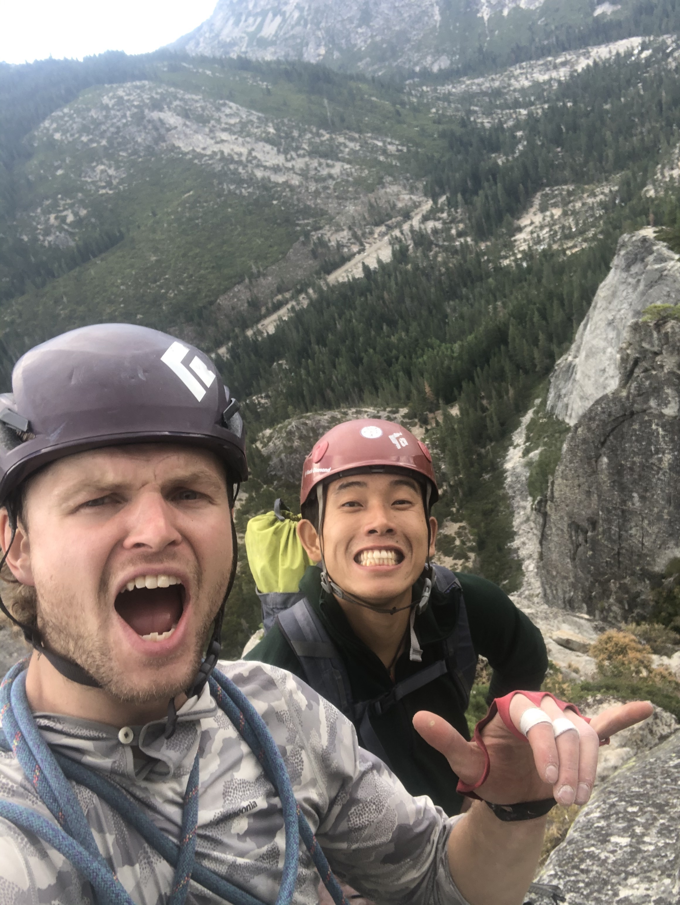

With rain calling at 11am, we set off at the crack of dawn thinking we would do as many pitches as possible. Although the rain did not get us till 2pm, the bird poops cemented on Under the Big Top sure did. The 35m heinous traverse consists of a cruxy slopey start, a pumpy hand to finger jam feast with no feet, non-stopping hands over hands of birds' poop, and the last section of unrelenting fingery finish with crumbling rocks. Nothing of the climb could make me believe that we were in Lover's Leap. For every cheese grading wiper I took, I cursed at the wall, the birds, and my bad planning for getting us over here. An hour later, I was finally able to see and hear my partner Fraser. The long and agonizing traverse shook us, but we quickly got over it after a long pitch of Traveler's buttress. We run up East Corner in 20 mins while the rain is falling. We didn't finish 25 pitches, yet the day felt perfect.

Time breakdown:
- 600 at base
- 651 top of Surrealistic Pillar (Leo & Fraser)
- 705 start Tombstone terror (Fraser)
- 800 finish Tombstone terror, Boothil (Leo), Traveller’s Buttress (Leo)
- 840 on Hospital Corner (Fraser)
- 1000 finish Gamoke (Leo) and Hospital Corner
- 1013 on Arctic Breeze (Fraser)
- 1058 finish Stem Meister (Leo)
- 1105 on Enigma (Fraser)
- 1140 on Under the Big Top (Leo)
- 134 finished Traveler Buttress (Leo)
- 224 start of East Corner (Fraser)
- 300 top of East Corner