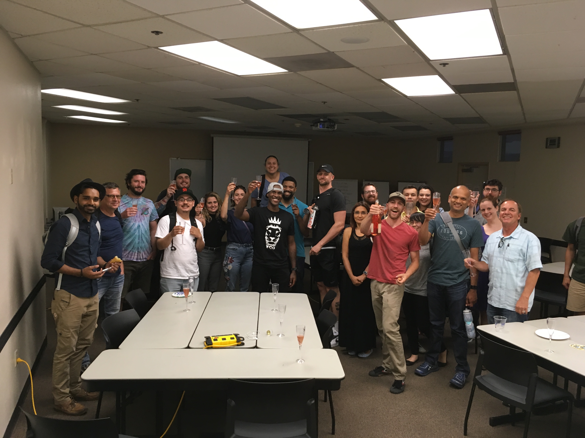
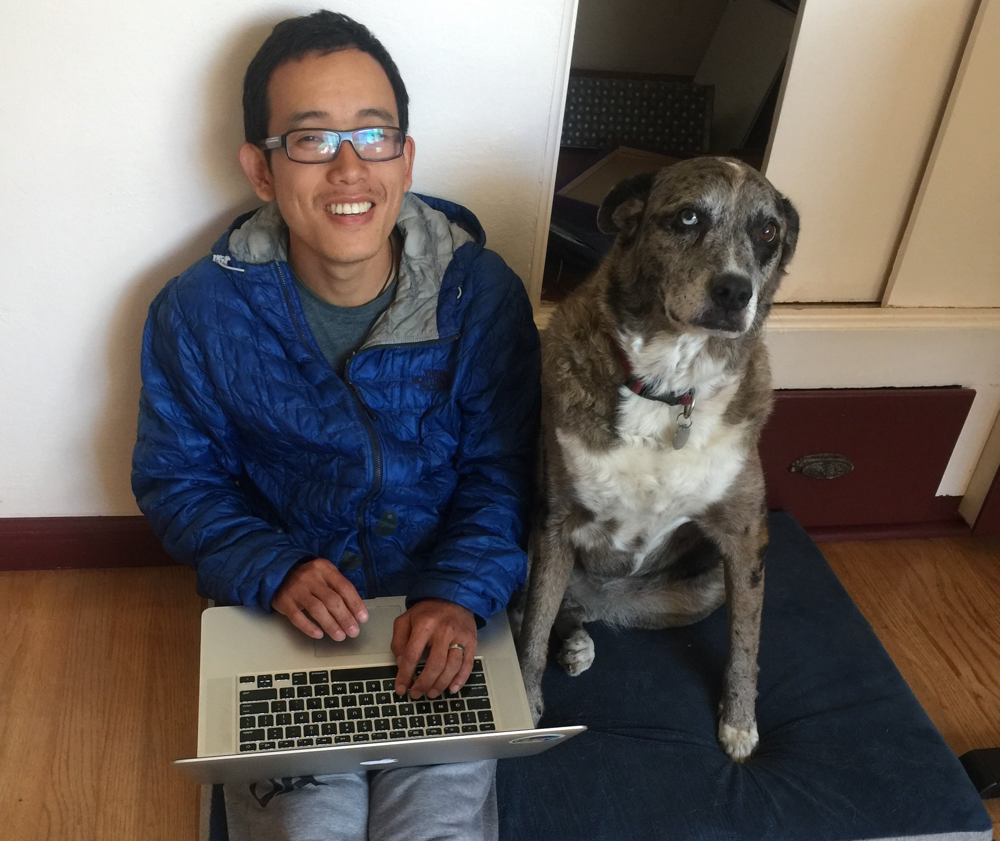

## Growing up

I grew up in China in a small town [牡丹江](https://en.wikipedia.org/wiki/Mudanjiang) in northeast China near Russia and North Korea. My mom is a hard working business woman who grew a successful business teaching English to middle/high school students. She started it off by tutoring our neighbors and eventually built a 300+ students school at the heart of the city. She repeated the same process once she moved to the US, but in early childhood development. She never stopped working, and she wouldn't even if she could. I did not truly understand or appreciate how much her successful stories and work ethics have shaped me until I was in my 20s while starting my own career.

During the years that my mom was starting her business teaching English in China, I would sit in on all her classes. I remember the days when I would raise up my hand to answer the toughest grammar question those high school students could not even answer. She used to tell the story that I was the first teacher most students would get when they first come to her school, because I was an "expert" teaching the English alphabet. Many years later in the US, when I stood in front of my classroom full of students teaching web development, I always felt the sense of belonging and familiarity. It felt like I have been here for many years. I was confident to communicate difficult ideas, lead students who were lost and sympathize with those who were falling behind. Since then, I have transitioned myself working in a startup leading a small group of developers, and those same exact set of skills have benefited me immensely.

## Coming to the US

You know you can run `git reset --hard HEAD` on a git repo to reset all the current changes you no longer need? That's how I felt leaving China to the US, and what was being reset was my entire life.

On the way back to the soon-to-be home after landing in the US, I was rather underwhelmed by what they were calling the "the cradle of technologies", Silicon Valley. My perception of big tall towers hoving over the sky was replaced by these tiny and unimpressive buildings. That was not the only surprise for the upcoming months. You may not like this, but it was rather convenient that the majority of the Chinese citizens do not have any say in the politics. On the other hand, the US was the total opposite in 2008. It seemed that I could not carry a small conversation without hearing about the upcoming election. In the beginning I pretend to listen using my very limited vocabularies, and try to memorize some key words and phrases to Google them at night. Studying these words and phrases were easy, but I always end up spending long hours reading the stories behind them and catching up or falling into the fascinating but crude American history. Towards the end of the third month, I could finally understand most words in a sentence and the significant for a black man to become the president.

> "You must be shapeless, formless, like water. When you pour water in a cup, it becomes the cup. When you pour water in a bottle, it becomes the bottle. When you pour water in a teapot, it becomes the teapot. Water can drip and it can crash. Become like water my friend." - Bruce Lee

I embraced myself being in this new environment. Everyday there was a new challenge, and another opportunity for me to mold myself. I push myself to become more like water, by adapting new environments in life and work.

## Becoming a software engineer

It surprises me everytime when I think about how long it took me to switch my career into software development. After graduating from UCD as an aerospace engineer, I worked in the field of [metrology](https://en.wikipedia.org/wiki/Metrology) for a couple years. The job only fulfilled me when it was challenging. What seemed interesting in the beginning, eventually became dull and boring. What I needed was a constant challenge, and in software I could always find that. Once I discovered programming, I could not put it down. From learning HTML/CSS, to data structures, and eventually landed myself as an instructor position in UC Davis coding bootcamp within one year since I first my transition.

> "Do a huge volume of work. Put yourself on a deadline so that every week or every month you know you're going to finish one story. It is only by going through a volume of work that you're going to catch up and close that gap. And the work you're making will be as good as your ambitions." - Ira Glass

The joy of programming drives me to do a lot more work than what is expected of me. I believe that is how I could be good at it, through a large volume of work to push myself to become as good as it can be.

## Joining a start-up

I joined Foodnome in Nov 2018 as a co-founder/tech lead, and started to rebuild the entire platform from the ground up. There are lots of bad reasons why I wanted to work in a startup when I first joined. Slowly but surly those give in to something more reasonable: responsibility and teammates.

Having worked in a 8-5 desk job, it is gratifing knowing the work I put into a startup today matters tomorrow. Before I even leave my bed in the morning, I could never fight the urge to check on my phone to see if there are any updates. Picking up the phone usually evolves me into grabbing my computer that is sitting next to the bed and making a move towards my home office. I would sit by my computer and hopefully find a time to drag myself to brush my teeth and walk Roxy 🐶 by noon. I find joy doing what I do. I understand without the work I do, the company would not be running smoothly. My co-workers depend on the completion of my work as much as I rely on them to finish theirs.

Working in a startup is tough, everyone is under constant stress. I feel lucky enough to have an amazing group of friends that I could trust and share our differences. Believe me, we argue a lot, but in the end we resolve these differences to push the growth of our company.

As of April 2020, we still maintain a small team while mantain a full line of product, but are actively looking for more devs. If you are interested, send me a message on [Twitter](https://twitter.com/leog0esger).

## Other fun facts

- I climb a lot with my wife Noelle, and we first met in [Rocknasium](http://www.rocknasium.com/). We mostly do bouldering or trad.
- Climbed [The Nose](<https://en.wikipedia.org/wiki/The_Nose_(El_Capitan)>) in "a day" (27 hrs, one push).
- Private pilot, I got my license a few years back in [Cal Aggie Flying Farmers](https://www.calaggieflyers.com/). Although it is expensive to fly, I try to keep myself up to date at the Reno airport.
