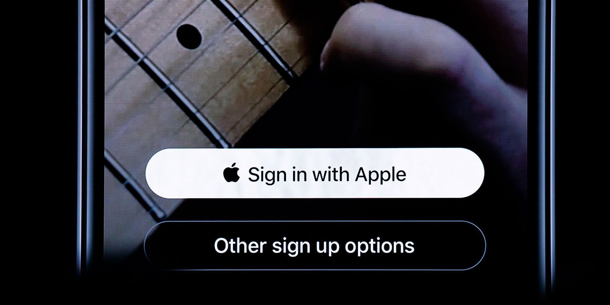

## Configure Private Email Relay Service

Apple needs to know where the email is coming from when using private emails. This sounds intimating, but it is rather easy to do.

1. In Certificates, Identifiers & Profiles, select More from the sidebar, and click Configure Sign in with Apple
2. Click Add button, and enter the email domains where these emails will be coming from
3. Enter a comma-delimited list of unique email addresses will be used
4. Once saved, it will not pass at this moment.
5. Go to Settings, and toggle Sign in with Apple
6. Go to your DNS host, add TXT Record