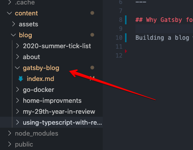
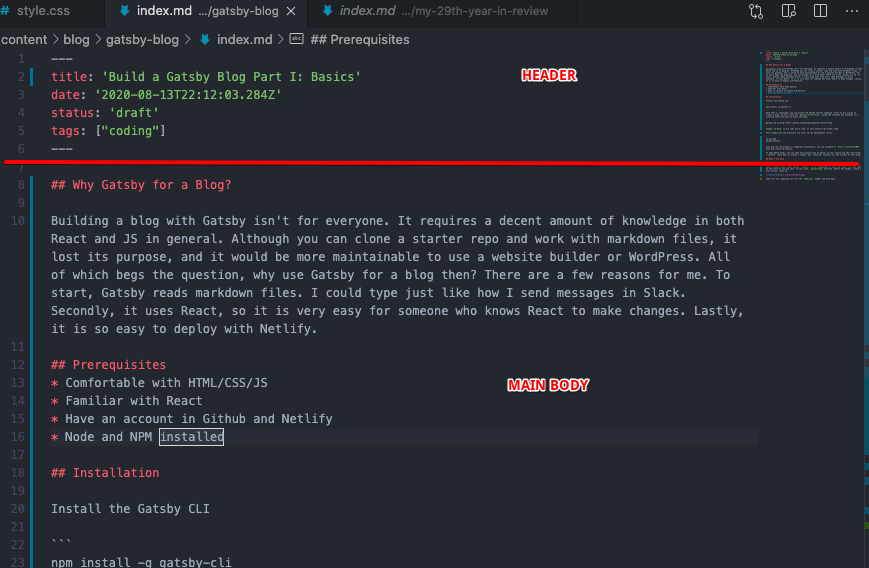
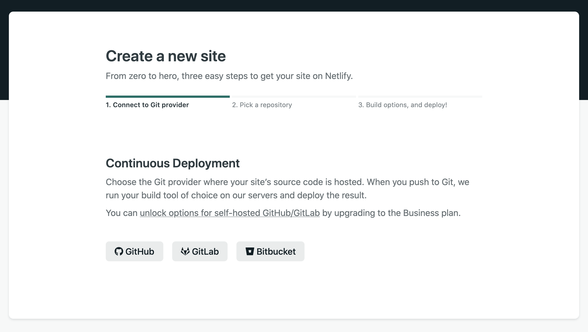
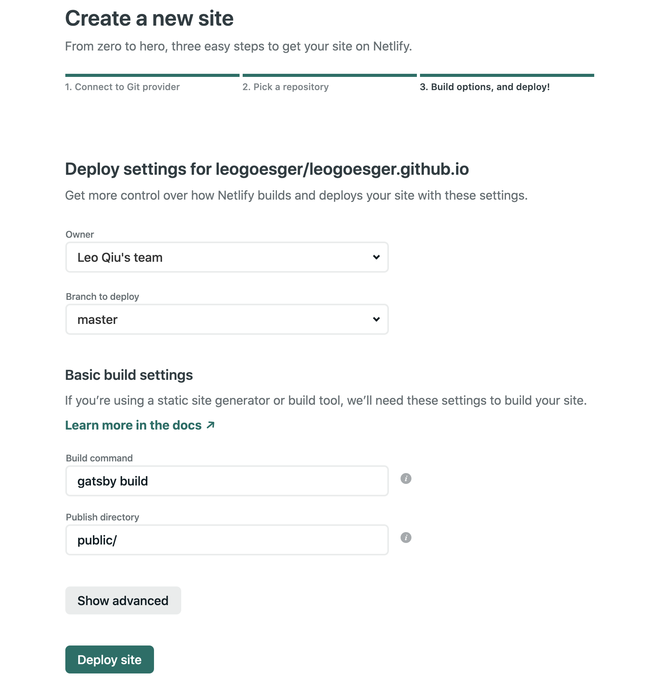

Building a blog with Gatsby isn't for everyone. It requires a decent amount of knowledge in both React and JS in general. Although you can clone a starter repo and work with markdown files, it lost its purpose, and it would be more maintainable to use a website builder or WordPress. All of which begs the question, why use Gatsby for a blog then? There are a few reasons for me. To start, Gatsby reads markdown files. I could type just like how I send messages in Slack. Secondly, it uses React, so it is very easy for someone who knows React to make changes. Lastly, it is so easy to deploy with Netlify. 

## Prerequisites 
* Comfortable with HTML/CSS/JS
* Familiar with React
* Have an account in Github and Netlify
* Node and NPM installed

## Installation

Install the Gatsby CLI

```
npm install -g gatsby-cli
```

Once that is installed, you can browse the Gatsby starter template. Since we are trying to create a blog, we will clone the `gatsby-starter-blog`. Using the terminal and navigate to a location where you want to store the blog.

```
gatsby new my-blog https://github.com/gatsbyjs/gatsby-starter-blog
```

Change `my-blog` to any name you'd like. It only affects the folder name.

Then change into the directory and start up the development server.

```
cd my-blog 
gatsby develop
```

Once you see the project is compiled successfully, you can navigate to `http://localhost:8000` with your favorite browser. 

To add/remove blogs, you can open the project with an editor of your choice and edit the folder `/content`. Each post is within a folder, and `index.md` contains all the content of each blog.

## Make a new post

Let's say we want to create a new post called "Gatsby Blog".

First, create a new folder within `content`. It is recommended to name the folder the same name as the title of the new post. In this case, `gatsby-blog` would do. Within the folder, create a file called `index.md`.



There are two components that go into the `index.md`: header and main body. The header section contains the meta-information about the post: title, date, status and etc. The main body contains the post's content. 



### Header

Technically, we can use as many fields as possible. In the future post, we will add a tag field. For simplicity, we will stick to two fields: title and date. 

The title will be the blog's title, and the title will also be embedded within the URL when you share it with others. If the post name is `Gatsby Blog`, the URL to share this post would be `https://your-domain.com/gatsby-blog`.

### Main Body

This is where you want to put the words, pictures, quotes, code snippets, etc. For typical markdown here is a list of items you may want to know.

|  |  |
| ----------- | ----------- |
| Heading | # h1 <br/> ## h2 <br/> ### h3   |
| Bold | \*\*bold text\*\* |
| Italic | \*italicized text\* |
| Blockquote | \> blockquote |
| Ordered List | 1. First item <br/> 2. Second item <br/> 3. Third item |
| Unordered List | - First item <br/> - Second item <br/> - Third item |
| Code | \`code`` |
| Horizontal Rule | --- |
| Link | \[title\](https://example.com) |
| Image | \!\[alt text\](./image.jpg) |
| Fenced Code Block | \`\`\`<br/>{<br/>"firstName": "Leo", <br/>"lastName": "Qiu" <br/>}<br/>\`\`\` |
| Task List | 	- [x] Write the press release<br/> - [ ] Update the website<br/> - [ ] Contact the media |

With these you can create your first blog posts!

## Deployment

You can easily hook up Netlify with your Github account. Every time you push to Github's master branch, it will trigger a build in Netlify account.

### Push to Github
First push your project to Github. There are a few steps you need to take.

1. Create a Github repo
2. Copy the Github url of the repo
3. `cd` into your project in your local machine
4. Add `remote origin`, and push  
```
git remote add origin <github_url>
git add .
git commit -m "init commit"
git push origin master
```

### Deploy site to Netlify

1. Login to [Netlify](https://app.netlify.com/start)
2. Click on **New site from Git**  
  
3. Click on `Github`
4. Find your project's repo you just created and click next  
 
5. Set **Branch to Deploy** to `master`
6. Click **Deploy Site**
7. Wait for a few seconds, a live link to your site will be generated
8. In the setting of Netlify, you can change to your custome domain

## Recap

That's about it! Without customization, this entire process takes me less than 10 mins. It is pretty cool to be able to write blogs using markdown. To update the site, all you need to do is to push to master.