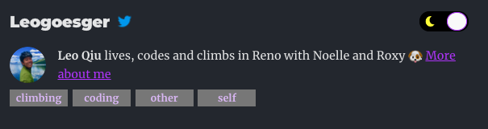

Continuing with Part I, we can add more fancy features in this section. With more people prefer dark mode, it is much needed to provide an option to toggle between dark and bright. When we share our posts, we also want to display a meta image to grab the reader's attention.

## Prerequisites 
* Have a working and deployed version of Gatsby site

## Topics

Feel free to skip the features you do not want or need. The demo below also shows the scroll to anchor feature as well.

 - [Dark Theme](#dark-theme)
 - [Meta Image or OpenGraph Image](#meta-image-or-opengraph-image)

### Dark Theme

The toggle feature will heavily rely on CSS variables. We will create two sets of global CSS variables to be used in light mode and dark mode. Then all the HTML elements could use the common variables which are controlled by a toggle button. 

#### Installation
Install the plugins, `gatsby-plugin-dark-mode` and `react-toggle`. The toggle is just a UI component. You could omit that and build your own.

```
npm install gatsby-plugin-dark-mode react-toggle
```

Add the plugin to the `gatsby-config.js`. Make sure it is added to the correct section.

```js
// gatsby-config.js 
module.exports = { 
	plugins: [
		...
		'gatsby-plugin-dark-mode',
		...
	], 
}
```
#### Create a Toggle Component

In `src/components`, create two files `theme-toggler.js` and `theme-toggler.css`.

```js
// theme-toggler.js 
import React from 'react'
import { ThemeToggler } from 'gatsby-plugin-dark-mode'
import Toggle from 'react-toggle'
import './theme-toggler.css'
import { FaMoon, FaSun } from 'react-icons/fa'

export const ToggleBtn = () => (
    <ThemeToggler>
        {({ theme, toggleTheme }) => {
            return (
                <Toggle
                    checked={theme === 'dark' || !theme}
                    className="custom-classname"
                    icons={{
                        checked: <FaMoon color="yellow" />,
                        unchecked: <FaSun color="yellow" />,
                    }}
                    onChange={e => toggleTheme(theme === 'light' ? 'dark' : 'light')}
                />
            )
        }}
    </ThemeToggler>
)
```

We add a `onChange` event handler for the `Toggle` button. The CSS file to make the button a bit prettier. You can totally ignore it.

```css
/* theme-toggler.css */
.react-toggle {
    touch-action: pan-x;
    display: inline-block;
    position: relative;
    cursor: pointer;
    background-color: transparent;
    border: 0;
    padding: 0;
    -webkit-touch-callout: none;
    -webkit-user-select: none;
    -khtml-user-select: none;
    -moz-user-select: none;
    -ms-user-select: none;
    user-select: none;
    -webkit-tap-highlight-color: rgba(0, 0, 0, 0);
    -webkit-tap-highlight-color: transparent;
}

.react-toggle-screenreader-only {
    border: 0;
    clip: rect(0 0 0 0);
    height: 1px;
    margin: -1px;
    overflow: hidden;
    padding: 0;
    position: absolute;
    width: 1px;
}

.react-toggle--disabled {
    cursor: not-allowed;
    opacity: 0.5;
    -webkit-transition: opacity 0.25s;
    transition: opacity 0.25s;
}

.react-toggle-track {
    width: 68px;
    height: 28px;
    padding: 0;
    border-radius: 30px;
    background-color: #4d4d4d;
    -webkit-transition: all 0.2s ease;
    -moz-transition: all 0.2s ease;
    transition: all 0.2s ease;
}

.react-toggle:hover:not(.react-toggle--disabled) .react-toggle-track {
    background-color: #000000;
}

.react-toggle--checked .react-toggle-track {
    background-color: #000000;
}

.react-toggle--checked:hover:not(.react-toggle--disabled) .react-toggle-track {
    background-color: #000000;
}

.react-toggle-track-check {
    position: absolute;
    display: flex;
    align-items: center;
    width: 14px;
    height: 10px;
    top: 0px;
    bottom: 0px;
    margin-top: auto;
    margin-bottom: auto;
    line-height: 0;
    left: 8px;
    opacity: 0;
    -webkit-transition: opacity 0.25s ease;
    -moz-transition: opacity 0.25s ease;
    transition: opacity 0.25s ease;
}

.react-toggle--checked .react-toggle-track-check {
    opacity: 1;
    -webkit-transition: opacity 0.25s ease;
    -moz-transition: opacity 0.25s ease;
    transition: opacity 0.25s ease;
}

.react-toggle-track-x {
    position: absolute;
    display: flex;
    align-items: center;
    width: 14px;
    height: 10px;
    top: 0px;
    bottom: 0px;
    margin-top: auto;
    margin-bottom: auto;
    line-height: 0;
    right: 10px;
    opacity: 1;
    -webkit-transition: opacity 0.25s ease;
    -moz-transition: opacity 0.25s ease;
    transition: opacity 0.25s ease;
}

.react-toggle--checked .react-toggle-track-x {
    opacity: 0; 
}

.react-toggle-thumb {
    transition: all 0.5s cubic-bezier(0.23, 1, 0.32, 1) 0ms;
    position: absolute;
    top: 1px;
    left: 1px;
    width: 28px;
    height: 26px;
    border: 1px solid #4d4d4d;
    border-radius: 50%;
    background-color: #fafafa;

    -webkit-box-sizing: border-box;
    -moz-box-sizing: border-box;
    box-sizing: border-box;

    -webkit-transition: all 0.25s ease;
    -moz-transition: all 0.25s ease;
    transition: all 0.25s ease;
}

.react-toggle--checked .react-toggle-thumb {
    left: 38px;
    border-color: var(--textLink);
}

.react-toggle--focus .react-toggle-thumb {
    -webkit-box-shadow: 0px 0px 3px 2px #0099e0;
    -moz-box-shadow: 0px 0px 3px 2px #0099e0;
    box-shadow: 0px 0px 2px 3px #0099e0;
}

.react-toggle:active:not(.react-toggle--disabled) .react-toggle-thumb {
    -webkit-box-shadow: 0px 0px 5px 5px #0099e0;
    -moz-box-shadow: 0px 0px 5px 5px #0099e0;
    box-shadow: 0px 0px 5px 5px #0099e0;
}

.custom-classname.react-toggle--checked .react-toggle-track {
    background-color: #000;
}
  
```

#### Implement theming

The default theme names are `light` and `dark`. The plugin add the theme name to the `<body>` element's `className`. Under your global css file, add the themes.

```css
body {
  --bg: white;
  --textNormal: #222;
  --textTitle: #222;
  --textLink: #ff6060;
  --blockQuote: hsla(0, 0%, 0%, 0.59);
  --blockQuoteBorder: 0.32813rem solid hsla(0, 0%, 0%, 0.9);
  --buttonBackground: rgb(239, 239, 239);
  --codeText: black;
  --buttonText:rgb(245, 165, 0);
  --codeBackground: #f5f5f5;
  --hr: hsla(0, 0%, 0%, 0.2);
  background-color: var(--bg);
}

body.dark {
  -webkit-font-smoothing: antialiased;
  --bg: #282c35;
  --textNormal: rgba(255, 255, 255, 0.88);
  --textTitle: white;
  --textLink: #b238ff;
  --blockQuote: hsla(0, 0%, 100%, 0.59);
  --blockQuoteBorder: 0.32813rem solid hsla(0, 0%, 100%, 0.9);
  --buttonBackground: #828282;
  --buttonText: rgb(219, 190, 247);
  --codeText: white;
  --codeBackground: #424242;
  --hr: hsla(0, 0%, 100%, 0.2);
}
```

To actually use the theme, you can target the HTML element directly.

```css
section a {
  color: var(--textLink)
}

section p {
  color: var(--textNormal)
}

section li {
  color: var(--textNormal)
}

nav a {
  color: var(--textLink)
}
```

#### Add the Toggle button to your header

This part should be pretty straight forward. You can put the toggle button anywhere, but header makes the most sense. Change your `src/components/layout.js`

```js
...
import { ToggleBtn } from "./theme-toggler"
...

return (
    <div className="global-wrapper" data-is-root-path={isRootPath} >
      <div>
        <div style={{ display: "flex", alignItems: "center" }}>
          ...
        </div>
        <ToggleBtn />

      </div>
      <main>{children}</main>
      <footer style={{ color: 'var(--textNormal)' }}>
        ...
      </footer>
    </div>
  )

```
With a few CSS changes, you should get something like the following.  

 
### Meta Image or OpenGraph Image

If you are using the `gatsby-starter-blog` you do not need to install anything. All we need to do here is to modify a few files to have the `seo` component pick up the `opengraph` tags.

Since each blog post will have its own image, we need to add it to its header.

```
---
 title: Hello!
 date: '2018-12-01'
 metaimage: './some-image.png'
---
```

In `src/templates/blog-post.js`, change the graphql query

```js
export const pageQuery = graphql`
  query BlogPostBySlug(
    $id: String!
    $previousPostId: String
    $nextPostId: String
  ) {
    site {
      siteMetadata {
        title
      }
    }
    markdownRemark(id: { eq: $id }) {
      id
      excerpt(pruneLength: 160)
      html
      frontmatter {
        title
        date(formatString: "MMMM DD, YYYY")
        description
        tags
        metaimage {
          childImageSharp {
            fixed {
              src
            }
          }
        }
      }
    }
    previous: markdownRemark(id: { eq: $previousPostId }) {
      fields {
        slug
      }
      frontmatter {
        title
      }
    }
    next: markdownRemark(id: { eq: $nextPostId }) {
      fields {
        slug
      }
      frontmatter {
        title
      }
    }
  }
`
```

And modify the component in `blog-post.js` as well.

```js
const BlogPostTemplate = ({ data, location }) => {
  const post = data.markdownRemark
  const siteTitle = data.site.siteMetadata?.title || `Title`
  const { previous, next } = data

  const { metaimage } = post.frontmatter
  const metaimagePath = metaimage?.childImageSharp?.fixed?.src
  return (
    <Layout location={location} title={siteTitle}>
      <SEO
        title={post.frontmatter.title}
        description={post.frontmatter.description || post.excerpt}
        image={metaimagePath}
      />
      ...
    </Layout>
  )
}
```

Then, add the `image` prop in `src/components/seo.js`. I also added a default image, in case the blog post did not provide one.

```js
...
import defaultOpenGraphImage from '../../content/assets/profile-pic.jpg'

const SEO = ({ description, lang, meta, title, image }) => {
  ...
  const ogImageUrl =
    site.siteMetadata?.siteUrl + (image || defaultOpenGraphImage)

  return (
    <Helmet
      htmlAttributes={{
        lang,
      }}
      title={title}
      titleTemplate={defaultTitle ? `%s | ${defaultTitle}` : null}
      meta={[
        ...
        {
          property: `og:image`,
          content: ogImageUrl,
        },
        {
          property: `twitter:image`,
          content: ogImageUrl,
        },
        {
          property: `image`,
          content: ogImageUrl,
        },
      ].concat(meta)}
    />
  )
}
```

And that's it! You can verify it in the chrome console.   


## Reference

* [Github Repo](https://github.com/leogoesger/leogoesger.github.io)