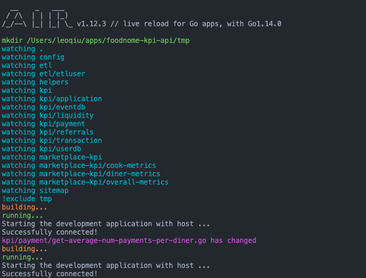

Using Docker with Go is a pretty common approach, but what draws me into using Docker is because Docker lets me create a self-contained image with everything my application needs to function. This solves many issues caused by the "What machine did you write your code on" problem. 

Adding Auto Reload makes sense because it would be difficult to re-build at each save. This may seem unnecessary at first since Go compiles rather fast, but in a larger application with more complex business logic, it is way nicer to be able to test it right away. 

## Goals

By the end of this article, you will:

* Learn how to install Docker,
* Create a Docker container for a Go application
* Sync Docker container with your local computer code
* Auto reload the application code running in Docker

## Install Docker

You can either use Docker ToolBox or Docker Desktop, or even both. I decided to use Docker Desktop because it has a very easy-to-use application with zero configuration needed. You can manage your images and containers directly within the application

Download link: https://hub.docker.com/editions/community/docker-ce-desktop-mac/

During install, the application needs to gain access to your computer.

## Build a Go HTTP server

If you already have a server, you can skip this part. Using Go module, you can create a folder anywhere. Inside `main.go`

```
package main
 
import (
    "io"
    "net/http"
)
 
func hello(w http.ResponseWriter, r *http.Request) {
    io.WriteString(w, "Hello world!")
}
 
func main() {
    http.HandleFunc("/", hello)
    http.ListenAndServe(":8000", nil)
}
```

At this point, you could run `go run main.go`, and verify the server is running by visiting `http://localhost:8000`. You should see `Hello world!`


## Auto-Reload in the local machine

To watch for changes in your code, we will use [Air](https://github.com/cosmtrek/air). There are many options out there, [Gin](https://github.com/codegangsta/gin) works pretty well as well. 

Install Air

```
go get -u github.com/cosmtrek/air
```

Createa file `.air.toml`

```
# Config file for [Air](https://github.com/cosmtrek/air) in TOML format

# Working directory
# . or absolute path, please note that the directories following must be under root.
root = "."
tmp_dir = "tmp"

[build]
cmd = "go build -o ./tmp/main ."
# Binary file yields from `cmd`.
bin = "tmp/main"

# Customize binary.
full_bin = "APP_ENV=dev APP_USER=air ./tmp/main"

# Watch these filename extensions.
include_ext = ["go", "tpl", "tmpl", "html"]

# Ignore these filename extensions or directories.
exclude_dir = [".git", "tmp", "vendor"]

# Watch these directories if you specified.
include_dir = []

# Exclude files.
exclude_file = []

# It's not necessary to trigger build each time file changes if it's too frequent.
delay = 1000 # ms

# Stop to run old binary when build errors occur.
stop_on_error = true

# Logs location
log = "logs/air_errors.log"

[log]
# Show log time
time = false

[color]
# Customize each part's color. If no color is found, use the raw app log.
main = "magenta"
watcher = "cyan"
build = "yellow"
runner = "green"

[misc]
# Delete tmp directory on exit
clean_on_exit = true
```

Air will create a `tmp` folder to store your files. The key thing here is the `cmd = "go build -o ./tmp/main ."` which will auto build and reload the app based on which files Air is watching. You can change the `cmd` to anything.



If everything works, you should see an output of all the files Air is watching. Every time a file is saved, the file name will be output with `FILE_NAME has changed`

## Create Dockerfile

Create a file in the root and name it `Dockerfile`

```
FROM golang:latest
RUN mkdir /app
ADD . /app
WORKDIR /app
RUN go mod download
RUN go get -u github.com/cosmtrek/air
CMD air
```

I am using the `latest` version of Go, but you can change that. `RUN mkdir /app` makes the app within the Docker image, and `ADD . /app` copies everything from your current directory at your local machine to the Docker image. `RUN go mod download` downloads all the dependencies for your Go project. I think Go implicitly downloads those for you regardless, so you could remove that line. `RUN go get -u ...` install `Air` on the container and runs it.

At this point, you can build the image

```
docker build -t my-go-app .
```

You can check the Docker Desktop -> Images, or VSCode extension images

To start your application in the container

```
docker run --rm -p 8001:8000 -v $(pwd):/app -d my-go-app
```

* `-p 8001:8000` - This exposes our application which is running on port 8000 within our container on http://localhost:8001 on our local machine.
* `-it` - This flag specifies that we want to run this image in interactive mode with a tty for this container process. Replace it with `-d` for detached mode.
* `my-go-app` - This is the name of the image that we want to run in a container.
* `-v $(pwd):/app` - This copies what you have in your local machine to docker, so code change will get copied over to the container, which will trigger a rebuild by `Air`

And that's it! It took me a while to figure out, but the whole process could have taken me a few mins. It is a big time saver in the long run. Good luck and Mask up!