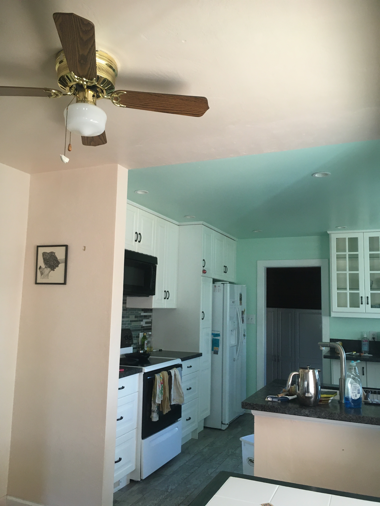
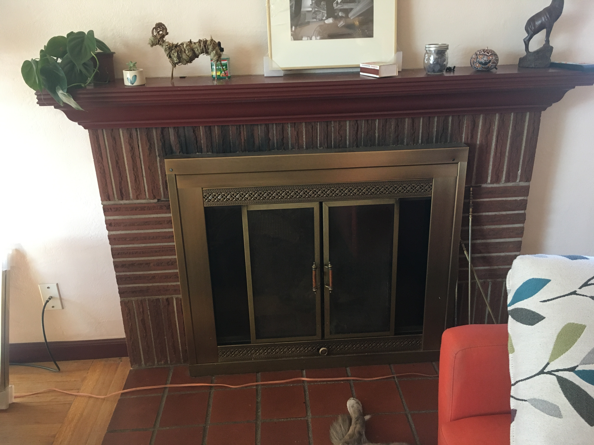
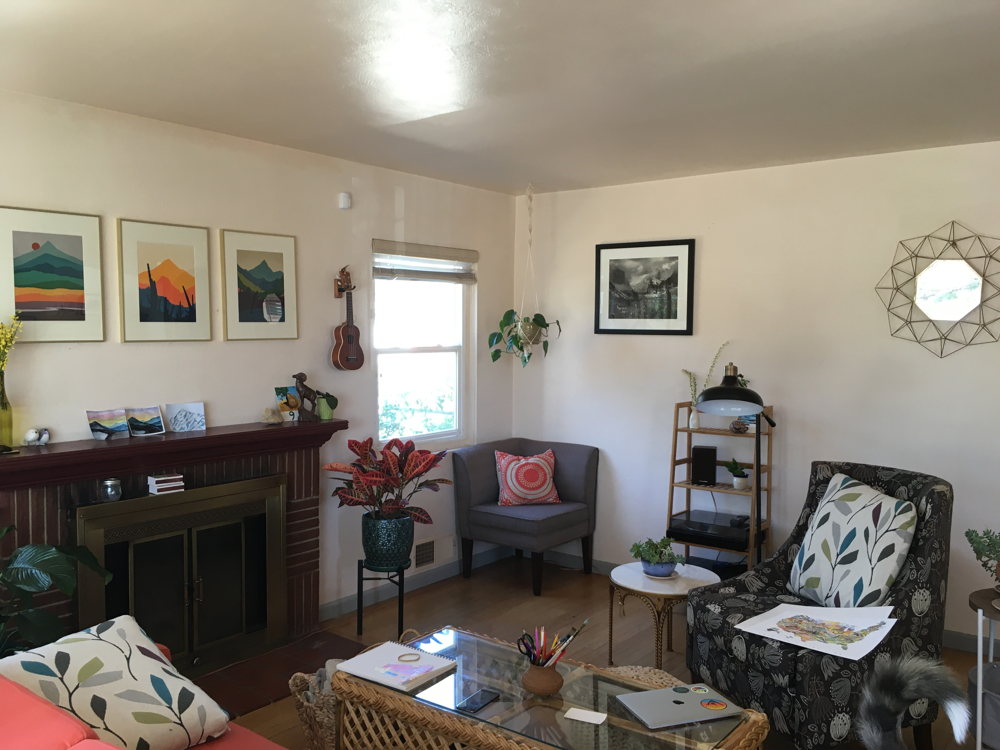
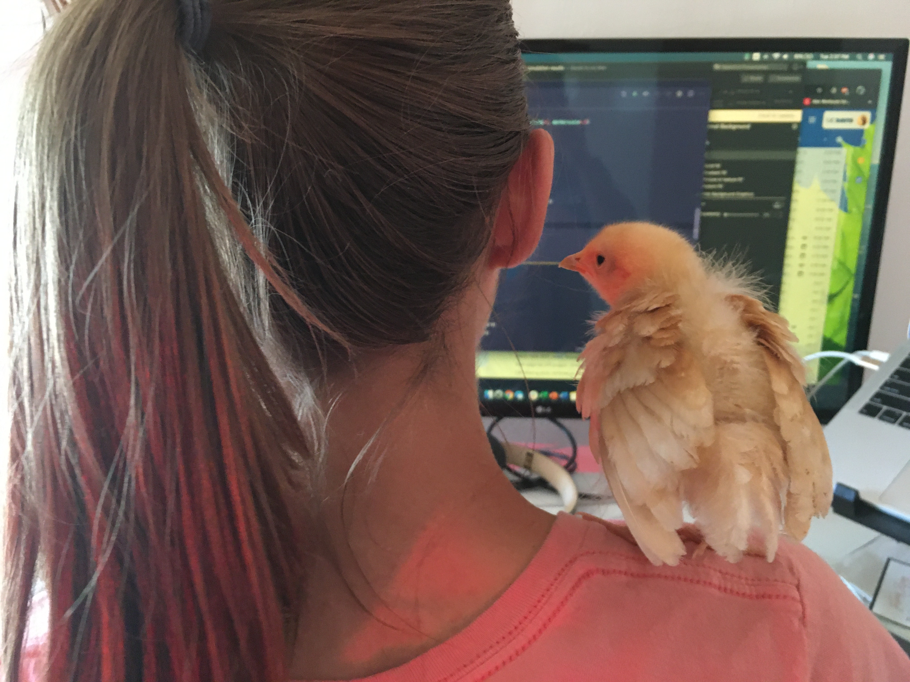
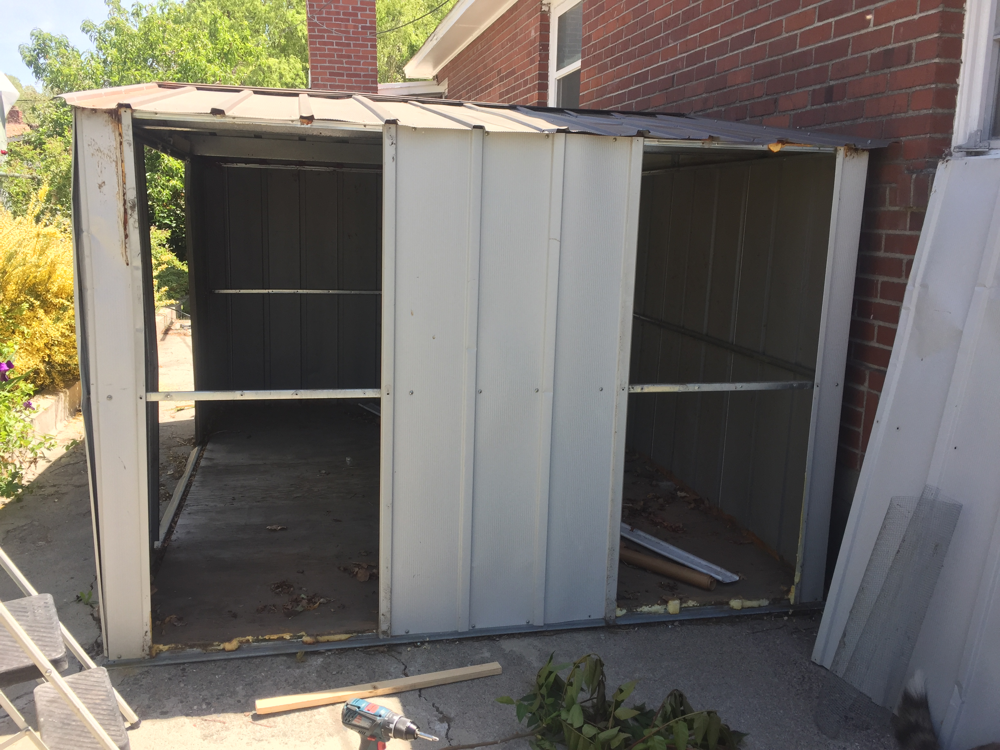
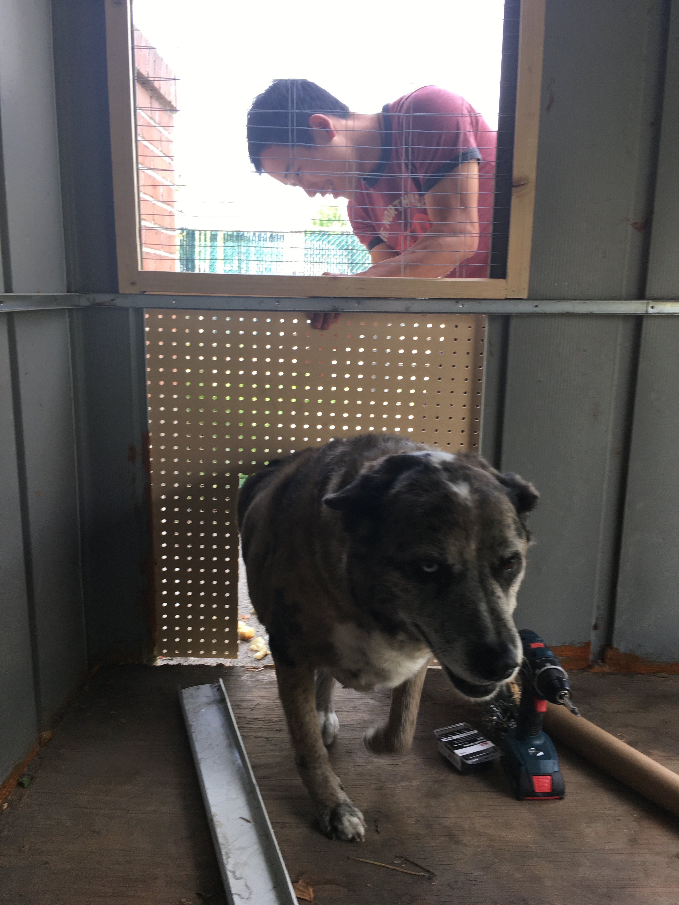
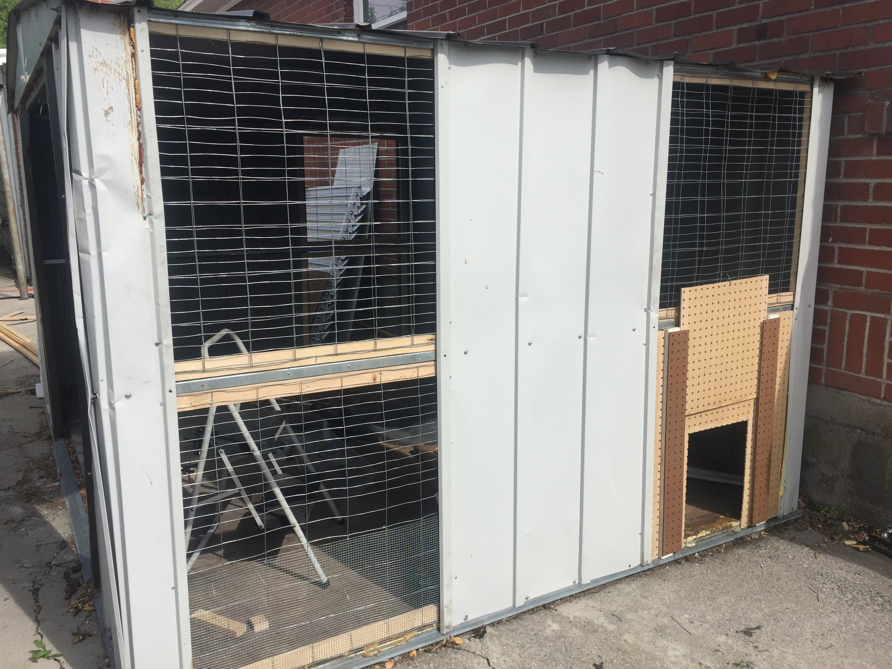
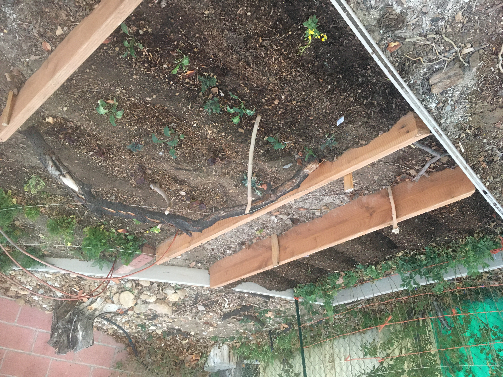
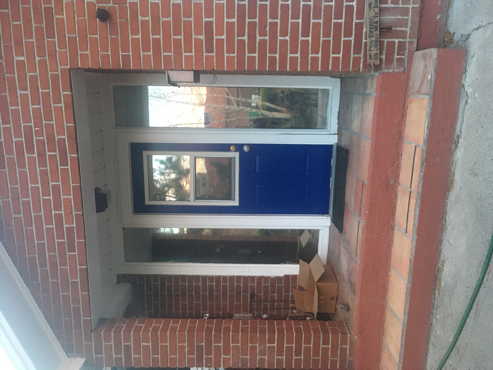
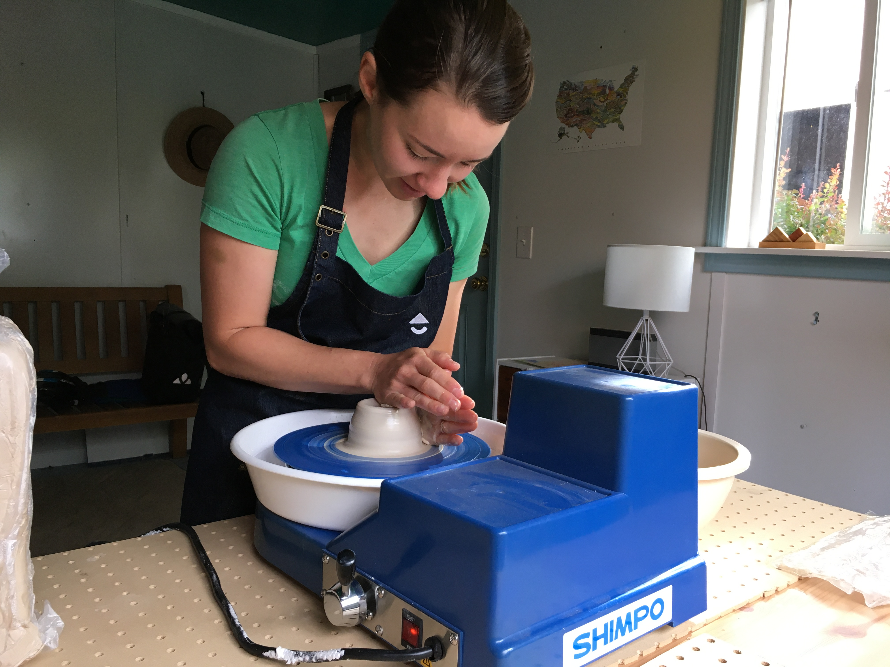

Recently our beloved housemates left us, along with all their amazing furnatures in our livingroom. This triggered a daily 1-2 hr session seaching through Facebook marketplace, and a weekly visit to Home Depot. After a two week search, we have successfuly re-furnished most of our house.

# Dinning Room

Repainted the dinning room

# Living Room

Repainted the living room, and sanded mantel

Mental before:

Mental after:

Livingroom re-paint:

Livingroom re-org:

# Chicken Coop

We got 6 chicks, and "re-modeled" a shed to become into a chicken coop. Set up a chicken run.

Cute chick:

Chicken coop shed:

Putting on the chicken door:

After installing all the panels:

Building the chicken run:

# Garden Beds

Removed a huge tree from the yard, and put in 3 more garden beds.

A small piece from this huge tree we removed:

Garden beds:

# Misc

Re-painted the door

Ceremic

