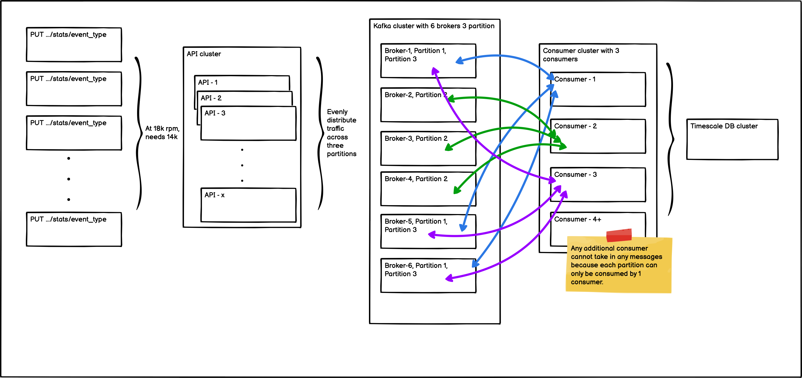
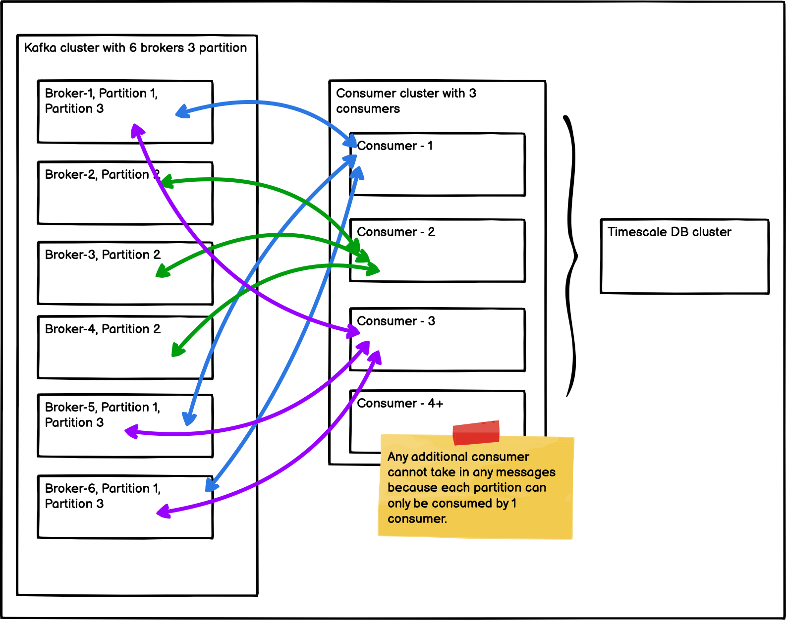

If I have a choice for picking any queuing system, I would pick AWS SQS. It is simple and efficient to configure and use. But, this time we are required to use a queue that can be deployed across different platforms and it landed onto Kafka. 

Here is a graph showing the overall setup. Queue is necessary here because we want separte out the logic inserting `events`, so this DB transaction does not cause a bottle neck in the API service.



## How does it work?

To ensure no messages get lost and data are constanly backed up, all messaging queue are `Replicated` and `Divided`. *Partition Number* determines how many chucks to divide all the messages within the queue, and *Replication Factor* determines how many times each chuck is replicated. This is confusing at first, but it becomes easier to understand once I understood that each partition can only be consumed once (determined by *Consumer Group ID*).



Graph above shows Kafka cluster has 6 brokers, and 3 partitions for a given topic. Broker-1 and Broker-5 holds partition 1, Broker-2 and Broker 4 holds partition 2 and etc. It is important to understand messages across the queue are distributed across these partitions. For example, if we have a message with "Hello World", this message can only exist in one of the partitions. That partition can only be consumed by one consumer unless they hold a different consumer group ID. So if you have 3 partitions, you could only have 3 consumers. Additional consumer would be doing nothing.

## Local Setup

Local setup can be done using docker `Zookeeper` and `Kafka` images. Zookeepr is used by Kafka brokers to determine which broker is the leader of a given partition and topic and perform leader elections.

```yml
zookeeper:
image: docker.io/bitnami/zookeeper:3.8
ports:
    - "2181:2181"
environment:
    - ALLOW_ANONYMOUS_LOGIN=yes

kafka-0:
image: docker.io/bitnami/kafka:3.2
ports:
    - "9092"
environment:
    - KAFKA_CFG_ZOOKEEPER_CONNECT=zookeeper:2181
    - KAFKA_CFG_BROKER_ID=0
    - ALLOW_PLAINTEXT_LISTENER=yes
depends_on:
    - zookeeper

kafka-1:
image: docker.io/bitnami/kafka:3.2
ports:
    - "9092"
environment:
    - KAFKA_CFG_ZOOKEEPER_CONNECT=zookeeper:2181
    - KAFKA_CFG_BROKER_ID=1
    - ALLOW_PLAINTEXT_LISTENER=yes
depends_on:
    - zookeeper

kafka-2:
image: docker.io/bitnami/kafka:3.2
ports:
    - "9092"
environment:
    - KAFKA_CFG_ZOOKEEPER_CONNECT=zookeeper:2181
    - KAFKA_CFG_BROKER_ID=2
    - ALLOW_PLAINTEXT_LISTENER=yes
depends_on:
    - zookeeper
```

To connect and use Kafka, a client library like [Kafka-go](https://github.com/segmentio/kafka-go) can be used. 

```go
kafkaDialer := &kafka.Dialer{
    Timeout:   (time.Duration(300) * time.Second),
    DualStack: true,
}

writer := kafka.NewWriter(kafka.WriterConfig{
    Brokers:      cfg.Hosts,
    Topic:        cfg.Topic,
    WriteTimeout: 10 * time.Second,
    ReadTimeout:  10 * time.Second,
    Dialer:       kafkaDialer,
})

// Send to queue
writer.WriteMessages(ctx, kafka.Message{
    Key:     []byte(s.key),
    Value:   someValue,
    Headers: []protocol.Header{{
        Key:   k,
        Value: []byte(someHeaderValue),
    }},
})

reader := kafka.NewReader(kafka.ReaderConfig{
    Brokers:         cfg.Hosts,       // kafka-0:9092,kafka-1:9092,kafka-2:9092
    Topic:           cfg.Topic,
    MinBytes:        10e3,            // 10KB
    MaxBytes:        10e6,            // 10MB
    MaxWait:         1 * time.Second, // Maximum amount of time to wait for new data to come when fetching batches of messages from kafka.
    ReadLagInterval: -1,
    GroupID:         "1",
    Dialer:          kafkaDialer,
})

// Receive message, and this is a blocking action until it receives the next message
msg, _ := reader.FetchMessage(ctx)

// Ack the message, so the same message will not be redelivered.
reader.CommitMessages(ctx, msg)
```

## Remote Setup

`AWS` makes setting up Kafka very easy using the web console, but make sure to use custom create and provisioned if need more configurations. 

- Create topic

```
/usr/bin/kafka_2.12-2.8.1/bin/kafka-topics.sh --create --bootstrap-server b-3.xxx.kafka.us-east-1.amazonaws.com:9092,b-2.xxx.kafka.us-east-1.amazonaws.com:9092,b-5.xxx.kafka.us-east-1.amazonaws.com:9092 --replication-factor 3 --partitions 6 --topic dev-stats
```

- Describe topic

```
/usr/bin/kafka_2.12-2.8.1/bin/kafka-topics.sh --describe --bootstrap-server b-3.xxx.kafka.us-east-1.amazonaws.com:9092,b-2.xxx.kafka.us-east-1.amazonaws.com:9092,b-5.xxx.kafka.us-east-1.amazonaws.com:9092 --topic dev-stats
```

- Delete topic

```
/usr/bin/kafka_2.12-2.8.1/bin/kafka-topics.sh --delete --bootstrap-server b-3.xxx.kafka.us-east-1.amazonaws.com:9092,b-2.xxx.kafka.us-east-1.amazonaws.com:9092,b-5.xxx.kafka.us-east-1.amazonaws.com:9092  --topic dev-stats
```

- Number of messages in Queue

```
/usr/bin/kafka_2.12-2.8.1/bin/kafka-run-class.sh kafka.admin.ConsumerGroupCommand --group "1" --bootstrap-server b-3.xxx.kafka.us-east-1.amazonaws.com:9092,b-2.xxx.kafka.us-east-1.amazonaws.com:9092,b-5.xxx.kafka.us-east-1.amazonaws.com:9092 --describe
```