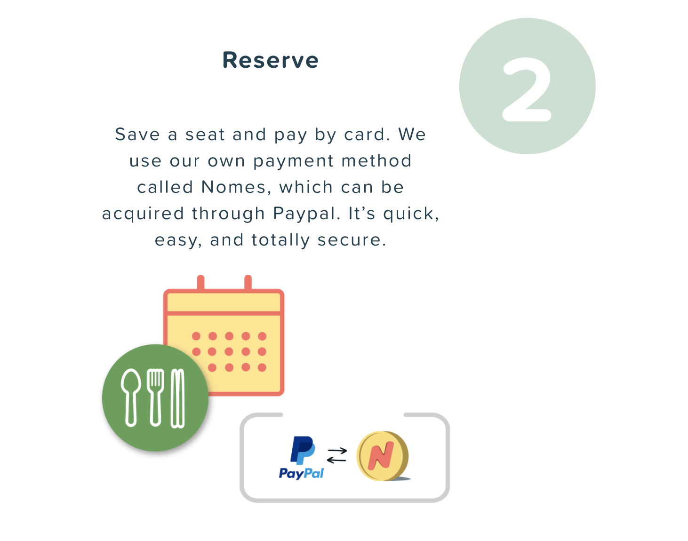

I just had this realization that when I turn 29 years old, it means I have already been living for 29 years and every day is closer to being 30. It is like the indexing in an array, index 29 is the 30th element in that array. And that fact scares me a bit.

The reason I am scared of being 30 is mainly because of this unreasonable goal that I set for myself. The goal to accomplish something “great” before I turn 30. I never defined the specifics, nor did I conclude what is considered as “great”. As daunting as the goal sounds, it pushes me to be productive with my time, forces me to take risks in my decisions, and unavoidably causes me stress when I feel stagnate.

Last year, I feel like I have made good progress pushing myself. Some progress is made by carefully planning, and then others are gained through painful mistakes. These signs of progress are becoming rules and advice for me to live by and all of this advice would also have been trivial a year ago. This will also lead to my first advice to myself.

## 1. Things are being done this way for a reason

I joined Foodnome in Nov 2019 and started building the platform on the first day. I was in most developers’ dreams by starting a project from scratch. To put my excitement in perspective, imagine you have a TV from the 50s, and you have been fixing it daily with obsolete parts. One day you were finally given a chance to purchase a new modern 4k TV. That’s how I felt. An opportunity to start fresh with the most cutting edge technology and build “the coolest and most awesome feature” in my mind.

One of the “awesome” features we built was our in-platform currency, nomes. It was “necessary” at the moment because we wanted to encourage users to stay on the platform. Users could purchase $100 worth of nomes, and use them for day to day meals. This would also save us from the PayPal transaction fees. To make it better, we even round off users’ charges. If a user purchased a meal for $13, we would just charge you $20 and keep the $7 to use for the next purchase.

Needless to say, it did not work. It created a very complex codebase to maintain with features like secure nome transfer, cash out, synchronization for reservations, etc. Besides those, the biggest issue was we simply could not provide enough meal options to be purchased with their extra nomes in their account. Users could be waiting for days until the next meal is offered in their areas.

The creative idea turned into a disaster, now we are back to the good-old checkout flow like most other online marketplaces (we kept some of the nome features). It isn’t perfect and costly, but it has been battle-tested. There are many nome-like features we created and scraped, and other ideas we decided against it in the beginning and eventually built.

Now I try to be more careful when proposing creative ideas by carefully measuring the efforts and rewards. When in doubt, doing things by the book is usually a safe and sound solution.

## 2. Support your teammates

During this unfortunate time due to COVID, support the people surrounds you is much more important than before. I can imagine it must be unpleasant stuck in the same room with someone with who you do not get along. But here I am more talking about work, specifically working in a small company. In a large company, you could anger someone and avoid them entirely, but in a six-person company like ours, dodging someone would be playing hide and seek in an empty cubed room. So, don't make the situation awkward for yourself and others. People do way better with position encouragement than rudely criticized daily.

## 3. Nothing is as hard as you thought

Before I started working for Foodnome, I was offered a job at UC Davis with really good pay. I turned down the job offer because it was way overpaid, and I thought the project might be too difficult for me to jump in without any supervision. Now looking back, I think that would have been a great opportunity I missed. For the past two years, not one project I have taken an easy project. Every single one of them requires me to do a massive amount of research and all have a steep learning curve. I have yet to find a task un-solvable. I don't think I have learned to solve harder problems from the past two years, but rather I have learned to accept engineering is all about problem-solving. If I already know the answer to a problem, it would probably not have needed me in the first place.

## 4. Things are harder than you might think

This is kind of a contradiction to point 3. After I solve a certain engineering problem, the solution immediately becomes obvious to me. I used to think some engineering solutions are so easy, everyone on the team ought to be able to understand without future explaining from myself. This turned out to be completely false. It negatively impacts the work I do and how I treat others. Some "obvious" solutions at the time may seem confusing at later times to even myself. Because it was all so "obvious", I never bothered with proper documentation, eventually wasting many hours of engineering time. Now I always tell myself to be as detailed as possible in documenting the process I took to solve the problem and try my best to convey my solution to my teammates. Many times, large improvements are made through these explaining processes.

I am excited for a new year to come and see the growth I will be making, and looking forward to documenting all of them when I turn 30!
