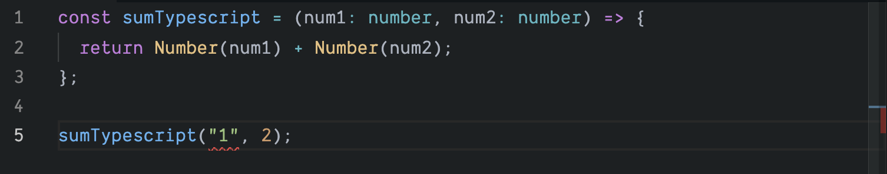

It has been about two years since I started using Typescript instead of Javascript in web development especially in React. Prior to using TS, I have always found the process of debugging in JS very difficult (I type something first, wait for webpack dev server to refresh, and finally receive the error message). I started trying Typescript mostly because I need a tool that has basic type support to speed up the development process.

In this post, I will walk through a simple React project built with Typescript which will include the following topics:

- Discuss on some of the basics on Typescript
- How to start a React project using Typescript
- Discuss whether to eject from CRA-TS or not
- How to declare prop types for React components
- How to use third party libraries

## 1. Typescript 101

One of the key benefits of Typescript to me is type annotation. Since my background has no [statically typed languages](https://en.wikipedia.org/wiki/Type_system), learning type annotation was rather a struggle. The syntax was unfamiliar and time consuming to write. It took me about one month of using it to start to appreciate its power and why many developers much prefer a statically typed language. There are lots of differences between statically typed languages and TS, but I will not discuss them here :)

Here I will create a simple example on how to convert a Javascript function to Typescript while explaining the benefits of type annotation.

We can start with a super simple `sum` function. A function takes two numbers and returns the sum.

```js
const sum = (num1, num2) => {
  return num1 + num2
}
```

To run this function, we can do `sum(1, 2)` which will output `3`. But what if we put in `sum("1",2)`? The code will output `"12"`(notice it is a string) without an error message. Down the line where we are expecting `3`, we will see a silent `"12"` being used.

At this point, we could try fix the bug with something like this:

```js
const sum = (num1, num2) => {
  return Number(num1) + Number(num2)
}
```

But what if we try to run `sum("abc", 2)`. As we see, it would be ideal to force both `num1` and `num2` to be a number. Warn us the potential error if we execute the function without a number. This is where Typescript comes in.

```ts
const sumTypescript = (num1: number, num2: number) => {
  return num1 + num2
}
```

Notice the `: number` we added at each of the arguments. This is simply saying, `num1` and `num2` both have to be a number.

At this point, if we would try `sumTypescript("1", 2)`, and run the program with `tsc file.ts`. You will see the error pops up, and this error will not get propagated down unknowingly.

> Argument of type '"1"' is not assignable to parameter of type 'number'

Even better, if you are using an editor like VSCode, you will see the red warning line under.



There are many benefits of using Typescript besides type annotation, you can read the documentation [here](https://www.typescriptlang.org/docs/home.html) or go through [Tutorials Point](https://www.tutorialspoint.com/typescript/index.htm).

## 2. Using Create React App - Typescript

To create a React app using Typescript is very simple.

```bash
npx create-react-app my-app --template typescript
# or
yarn create react-app my-app --template typescript
```

The rest is very similar to using Javascript. In the next section, we will talk about how to add type annotation for `props`.

If you need more information on how to set it up, you can refer to the [cheatsheet](https://github.com/typescript-cheatsheets/react-typescript-cheatsheet#reacttypescript-cheatsheets).

## 3. Ejecting from Create React App - Typescript or Javascript

This is rather a side note, I do not recommend ejecting from CRA for JS or TS. Mostly because the script files are being actively maintained. You lose those support once you eject from the project. But if there are some plugins you really need, ejecting might be the only way.

I needed a babel plugin optional chaining, and CRA did not support out of the box at the moment. I ejected a few weeks after they pushed another release, and I could no longer receive the regular updates.

In the case you have to have additional `babel plugins` and eject, you could add the plugin in the `package.json` file. In the example below, I added `optional chaining` and `nullish coalescing`, which both are supported by CRA 😭.

```json
{
  "babel": {
    "presets": ["react-app"],
    "plugins": [
      "@babel/plugin-proposal-optional-chaining",
      "@babel/plugin-proposal-nullish-coalescing-operator"
    ]
  }
}
```

## 4. Type annotation in an React app

In a React app, it is common to use [prop-types](https://www.npmjs.com/package/prop-types) to enforce certain data types being passed into a child component. We can achieve the same thing by using type annotation in Typescript.

For example if we have a functional component for a todos list, and we want to enforce this child component `List` receive an array with todos.

```js
import React from 'react'
import PropTypes from 'prop-types'

export const List = props => {
  return (
    <ul>
      {props.todos.map((todo, index) => (
        <li key={index}>{todo}</li>
      ))}
    </ul>
  )
}

List.propTypes = {
  todos: PropTypes.array.isRequired,
}
```

In Typescript, we can remove the `prop-types` library, and use the type annotation instead.

```ts
import React, { FC } from 'react'

interface IProps {
  todos: string[]
}
export const List: FC<IProps> = props => {
  return (
    <ul>
      {props.todos.map((todo, index) => (
        <li key={index}>{todo}</li>
      ))}
    </ul>
  )
}
```

Here is a list of changes:

- Imported `FC` because this is a [functional component](https://reactjs.org/docs/components-and-props.html)
- Created an interface and named it `IProps` (it is convention to name interface starting with letter `I`). `todos` is a prop passed down from the parent, and it is an array of string.
- `List` component returns a functional component but it takes `IProps` as props, therefore: `List: FC<IProps>`.

A prop can anything, and be added to the `IProps` interface. For example, if we have a `deleteTodo` function, it can be added to the interface.

```js
interface IProps {
  todos: string[];
  deleteTodo: (index: int) => void;
}
```

If a prop is an object, you can pre-define another interface and add to the `IProps`.

```js
interface ITodo {
  title: string;
  description: string;
  id: number;
}

interface IProps {
  todos: ITodo[];
  deleteTodo: (index: int) => void;
}
```

With React hooks, you can build most components with functional components. For class components, React provides a `Component` class where we can apply type annotation to its state and props.

```ts
import React, { Component } from 'react'

interface ITodo {
  title: string
  description: string
  id: number
}

interface IProp {
  todos: ITodo[]
  deleteTodo: (index: int) => void
}

interface IState {
  selected: ITodo | null
}

class TodoList extends Component<IProp, IState> {
  state = { selected: null }

  render() {
    return (
      <ul>
        {this.props.todos.map((todo, index) => (
          <div key={todo.id}>
            <li>{todo.title}</li>
            <button onClick={() => this.setState({ selected: todo })}>
              Select
            </button>
            <button onClick={() => this.props.deleteTodo(todo.id)}>
              Delete
            </button>
          </div>
        ))}
      </ul>
    )
  }
}
```

The key difference here between `FC` vs `Component` is FC takes one argument since it is a functional component, whereas class component takes two: `state` and `props`.

At this point, if we would to import a type annotated class or functional component, and supply it with incorrect props, the editor will warn us with the type issues while typing the code.

Unlike a strict static language, sometimes you may want to get lazy and do not want to use type annotation, then you can use `any`.

```js
interface ITodo {
 title: any
 description: any
 id: number
}
```

Then you can define `todo.title = 1`, `todo.title = ["abc"]` or assign it anything you like.

## 5. Using third party library

In most cases, types are already installed directly when you install the main library like React. In the case it is not, you can check on `npm` by searching `@types/${library_name}`.

```bash
npm install -D @types/lodash
```

## Happy coding!

I personally find Typescript is really fun to use, and do not see many downsides of using it. I would encourage most devs to give it a try and see how would it benefits your current projects.
